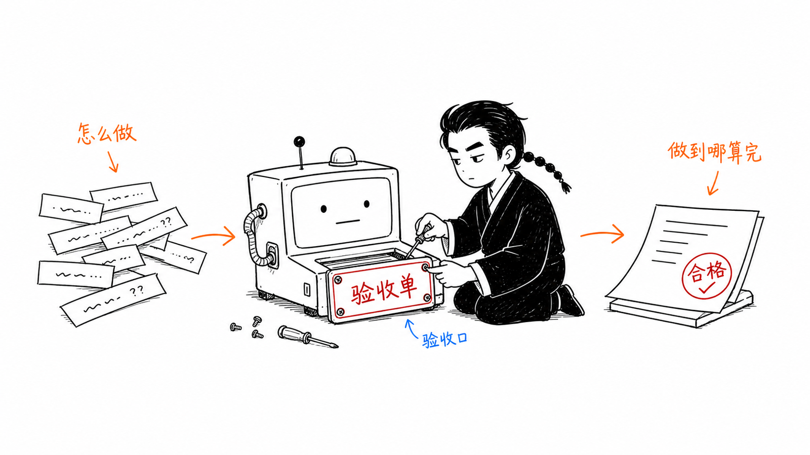

# 董浩安（辫子哥哥 Rocky）

## AI Agent × 电商增长 × 品牌出海实践

用 AI 重构电商内容生产与商业增长链路。

曾负责小红书商家赋能业务，全网 4W+ 粉丝，长期研究 AI Agent、短视频营销与跨境电商。

  

> 普通人的 AI 正式交付实验室
>
> AI 给初稿，人来验收，结果才算交付。

## 找到我

| 辫子哥哥 | 我是辫子哥哥 |
| --- | --- |
| 微信公众号｜辫子哥哥 | 微博｜我是辫子哥哥 |
| 小红书｜辫子哥哥 | 视频号｜我是辫子哥哥 |
| 抖音｜辫子哥哥 |  |
| 知乎｜辫子哥哥 |  |

### GitHub

[@bianzigege](https://github.com/bianzigege)

---

AI 给初稿 · 人来验收 · 结果才算交付
