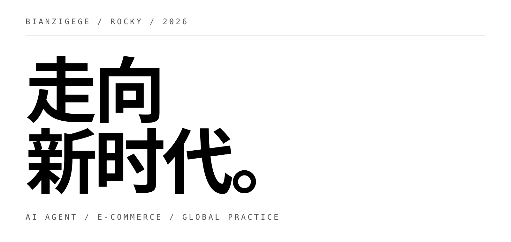
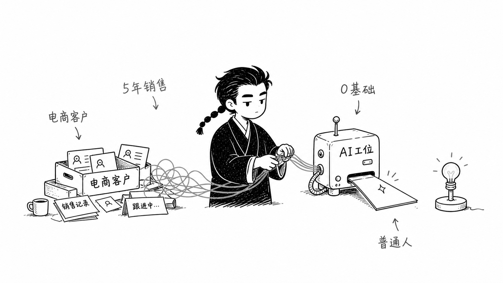
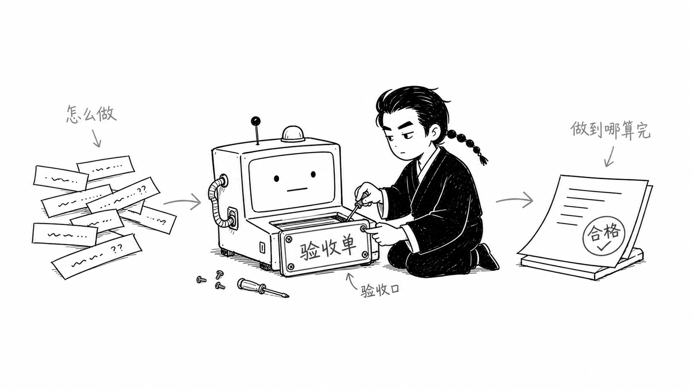
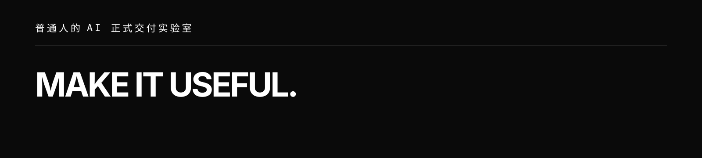

BIANZIGEGE / ROCKY / 2026

  

# 董浩安（辫子哥哥 Rocky）

**AI Agent × 电商增长 × 品牌出海实践**

用 AI 重构电商内容生产与商业增长链路。曾负责小红书商家赋能业务，全网 4W+ 粉丝，长期研究 AI Agent、短视频营销与跨境电商。

  

## About

<table>
  <tr>
    <td width="64%" valign="top">
      
<strong>普通人的 AI 正式交付实验室</strong>

      
我关注的不是“最强工具”，而是一件真实的事情，如何从模糊需求走到可以验收的结果。

      
<code>AI 给初稿 · 人来验收 · 结果才算交付</code>

    </td>
    <td width="36%" align="right" valign="top">
      
    </td>
  </tr>
</table>

## Selected work

<table>
  <tr>
    <td width="50%" valign="top">
      
       
      <strong>01 / AI 工作流</strong> 
      AI Agent · 电商增长 · 内容生产
      
把销售、内容和真实工作里的重复动作，整理成可以复用的工作流。

    </td>
    <td width="50%" valign="top">
      
       
      <strong>02 / 千川素材结构拆解 Skill</strong> 
      短视频营销 · 镜头拆解 · 开源项目
      
用 AI 自动完成短视频素材分析、镜头拆解和转化逻辑提炼。

      <a href="https://github.com/bianzigege/qianchuan-material-breakdown-skill">打开 GitHub 仓库 ↗</a>
    </td>
  </tr>
</table>

## Socials

| 辫子哥哥 | 我是辫子哥哥 |
| --- | --- |
| 微信公众号｜辫子哥哥 | 微博｜我是辫子哥哥 |
| 小红书｜辫子哥哥 | 视频号｜我是辫子哥哥 |
| 抖音｜辫子哥哥 |  |
| 知乎｜辫子哥哥 |  |

**GitHub** · [@bianzigege](https://github.com/bianzigege)

  

